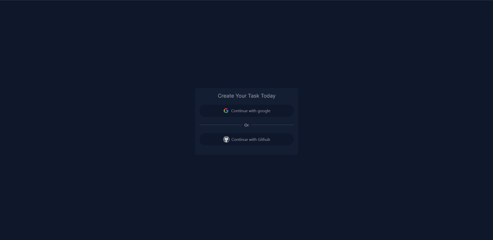

# Simple Todo app

Todo application frontend


## Installation

To install this project in you local machine you have to clone this repository first


```bash
  https://github.com/iam-MustakAhmedKhan/todo-app-frontend.git my-project
  cd my-project
  npm install
  npm run dev
```


## Screenshots

**login Page**


**main page**



## Tech / Libraries
**Server:** Node, Express

**Libraries:** mongoose, nodemon, swagger-ui-express, yamljs, dotenv, cors


## Author

- [@iam-MustakAhmedKhan](https://github.com/iam-MustakAhmedKhan)


## Usage/Examples

```javascript
import Component from 'my-project'

function App() {
  return <Component />
}
```


