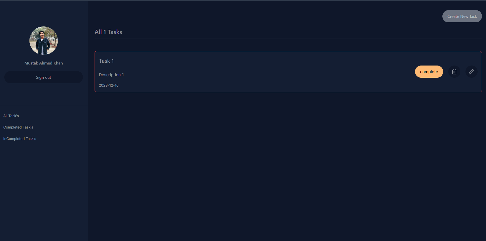

# Simple Todo app

Todo application frontend


## Installation

To install this project in you local machine you have to clone this repository first


```bash
  https://github.com/iam-MustakAhmedKhan/todo-app-frontend.git my-project
  cd my-project
  npm install
  npm run dev
```

## Folder Structure

├── public
├── src
│   ├── assets
│   ├── common
│   ├── components
│   ├── pages
│   ├── utils
├── index.html
├── node_modules
├── package.json
├── package-lock.json 
├── netlify.toml 
├── README.md
└── .gitignore


## Screenshots

**login Page**



**main page**


## Sever

**BackEnd Repository**
- [Server Repository](https://github.com/iam-MustakAhmedKhan/todo-app-backend)


## Author

- [@iam-MustakAhmedKhan](https://github.com/iam-MustakAhmedKhan)


